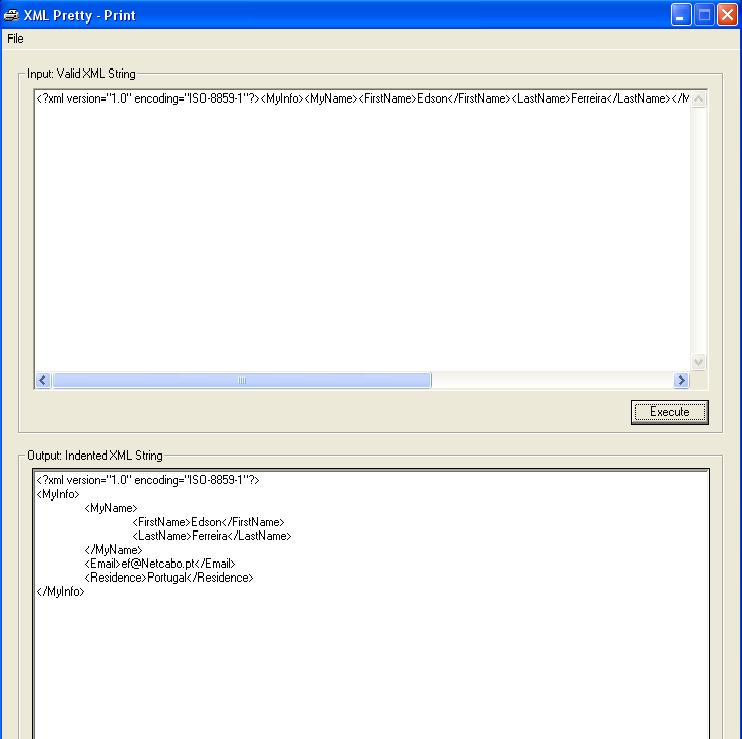



## XML PrettyPrint Test app

### Description

This small application is one example to show the possible use of the XML PrettyPrint Class.

In addiction, it allows you to save the indented XML string to a .xml or .txt file.
 
### More Info
 
Don't forget :

1. You must also download the XML PrettyPrint class to run this application.

2. Before you run this app. you must compile the class into XMLPrettyPrint.dll, register it and then, add its reference to this project

             |
---                |---
**Submitted On**   |2004-07-09 09:23:04
**By**             |[Edson Ferreira](https://github.com/Planet-Source-Code/PSCIndex/blob/master/ByAuthor/edson-ferreira.md)
**Level**          |Intermediate
**User Rating**    |5.0 (10 globes from 2 users)
**Compatibility**  |VB 6\.0
**Category**       |[OLE/ COM/ DCOM/ Active\-X](https://github.com/Planet-Source-Code/PSCIndex/blob/master/ByCategory/ole-com-dcom-active-x__1-29.md)
**World**          |[Visual Basic](https://github.com/Planet-Source-Code/PSCIndex/blob/master/ByWorld/visual-basic.md)
**Archive File**   |[XML\_Pretty176772792004\.zip](https://github.com/Planet-Source-Code/edson-ferreira-xml-prettyprint-test-app__1-54837/archive/master.zip)

